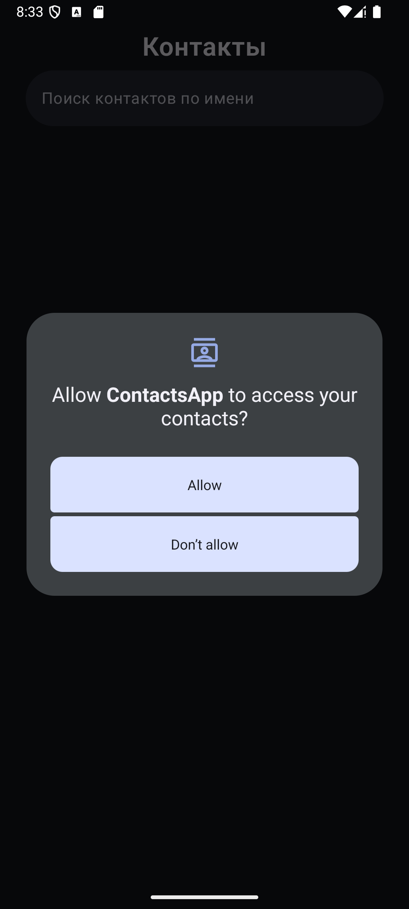
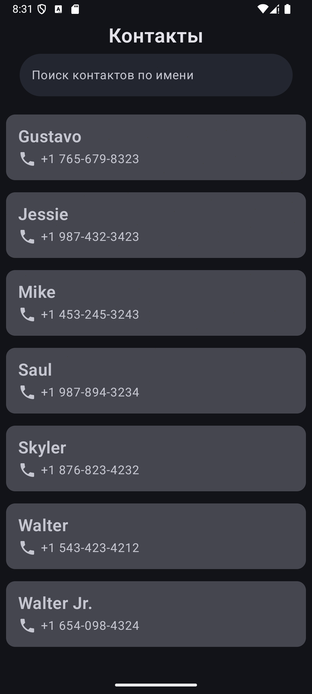
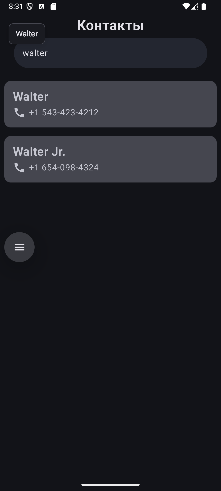
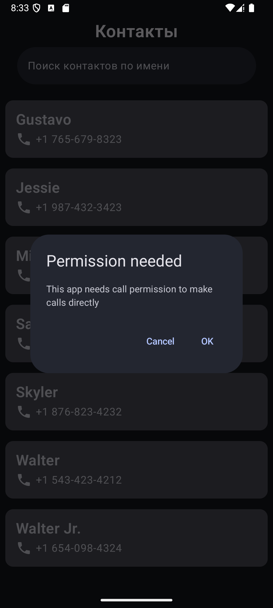
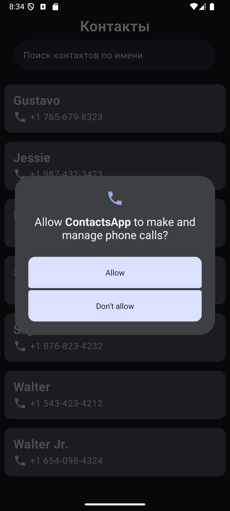
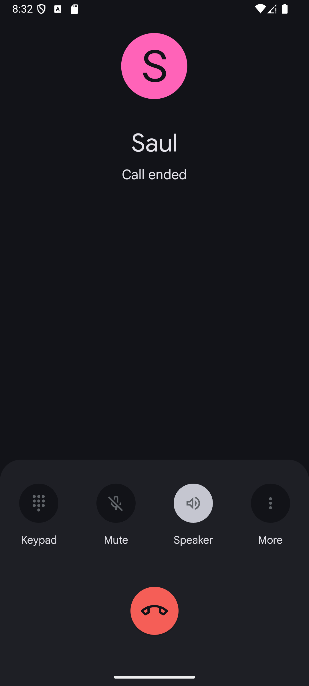

# Contacts App
Приложение для просмотра контактов устройства с возможностью поиска и быстрого звонка.

## Функционал

* Просмотр списка контактов устройства
* Поиск контактов по имени
* Быстрый звонок по нажатию на контакт
* Отображение состояния загрузки/ошибки

## Стек
* Язык: Kotlin
* Архитектура: Clean Architecture + MVVM
* UI: Jetpack Compose
* DI: Koin
* Асинхронность: Kotlin Coroutines + Flow

## Тестирование
Реализованы unit-тесты для ContactDataSourceImpl: JUnit, MockK

## Особенности реализации
* Использование ContentResolver для доступа к контактам
* Оптимизированный поиск с регулярными выражениями

## Скриншоты

    
Скриншоты приложения

